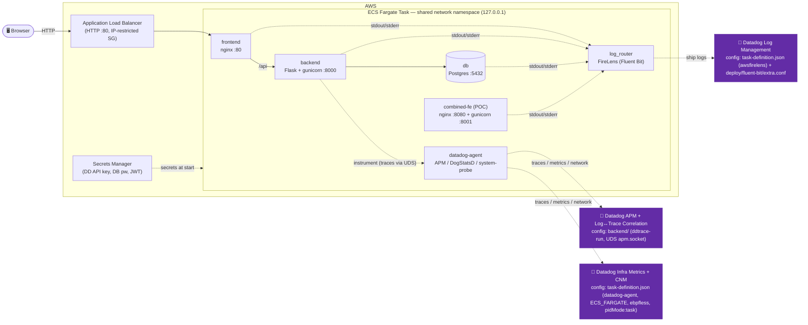

# Pay2Play — Fullstack ECS Fargate Deployment with Datadog

A multi-container financial-services demo (nginx + Flask/gunicorn + Postgres)
deployed as a single **AWS ECS Fargate** task and fully instrumented with
**Datadog** APM, Log Management (with log↔trace correlation), Infrastructure
metrics, and Cloud Network Monitoring — provisioned with a raw ECS task
definition + AWS CLI scripts (no Terraform/CDK).

## Overview

Pay2Play is a deliberately small "bank" app used as a test bed for
multi-container Fargate deployments with Datadog. All containers run in one
Fargate task; in `awsvpc` mode they share a single network namespace and talk
over `127.0.0.1` (locally, docker-compose gives each service a DNS name, which
is why nginx's backend target is templated via `BACKEND_HOST`). The backend uses
an app-factory pattern so future add-ons (Kafka producers/consumers, async
workers) can be layered in without restructuring.

| Container       | Tech                            | Role                                            |
| --------------- | ------------------------------- | ----------------------------------------------- |
| `frontend`      | vanilla JS + HTML + CSS, nginx  | Serves the SPA, reverse-proxies `/api`          |
| `backend`       | Python, Flask + gunicorn        | JSON API (JWT auth, accounts, transactions)     |
| `db`            | PostgreSQL 16                   | Users, accounts, transaction history            |
| `datadog-agent` | Datadog Agent sidecar           | APM / DogStatsD / infra metrics / CNM           |
| `log_router`    | AWS FireLens (Fluent Bit)       | Routes container logs → Datadog                 |
| `combined-fe`   | nginx + gunicorn (POC)          | *Optional:* one container, logs split by source |

## Architecture



## Datadog Configuration

| Signal | How it's wired | Config location |
| ------ | -------------- | --------------- |
| **APM** | Backend runs under `ddtrace-run`; traces go to the Agent over a **Unix Domain Socket** (`DD_TRACE_AGENT_URL=unix:///var/run/datadog/apm.socket`). `DD_AGENT_HOST` is intentionally unset, per the ECS Fargate docs. | `backend/entrypoint.sh`, `task-definition.json` (agent + backend env) |
| **Log↔trace correlation** | `DD_LOGS_INJECTION=true` + `python-json-logger` emit `dd.trace_id`/`dd.span_id` as top-level JSON fields. | `backend/app/logging_config.py` |
| **Logs** | FireLens (Fluent Bit) ships each container's stdout/stderr with a per-container `dd_source` (`nginx`, `python`, `postgresql`). | `task-definition.json` (`awsfirelens` `logConfiguration`) |
| **Log source-split (POC)** | `combined-fe` emits both nginx + python logs from one container; a custom Fluent Bit config `rewrite_tag`s nginx lines to a second Datadog output so they land as `source:nginx` while JSON stays `source:python`. | `deploy/fluent-bit/extra.conf` |
| **Infra metrics** | `ECS_FARGATE=true` on the Agent yields `ecs.fargate.*` / `container.*`. | `task-definition.json` (datadog-agent) |
| **Cloud Network Monitoring** | Fargate uses the **ebpfless** tracer: `DD_SYSTEM_PROBE_NETWORK_ENABLED`, `DD_NETWORK_CONFIG_ENABLE_EBPFLESS`, `SYS_PTRACE` capability, and task-level `pidMode:task` so the Agent can observe sibling containers. | `task-definition.json` |
| **DBM** | Intentionally **off** — the stock `postgres:16` image has no `datadog` DB user (see [Notes](#notes)). | — |

## Prerequisites

- **Docker** running locally (Docker Desktop or Colima).
- For Fargate: **AWS CLI v2** authenticated, plus a **VPC with two public
  subnets in different AZs**, an **ALB + target group**, security groups, two
  **IAM roles** (execution + task), and three **Secrets Manager** secrets
  (Datadog API key, Postgres password, JWT secret).
- A **Datadog API key** and your **site** (e.g. `datadoghq.com`).

> The full, prerequisite-by-prerequisite provisioning (secrets, IAM, networking,
> cluster, ALB) is scripted and documented in **[`deploy/README.md`](deploy/README.md)**.

## Setup

### Local — run & validate (no Datadog)
```bash
cp .env.example .env          # optional; compose has sane defaults
docker compose up --build
```
Then browse http://localhost:8080 and log in with a seeded user, or hit the API:
```bash
curl -s localhost:8080/api/health
curl -s -X POST localhost:8080/api/auth/login \
  -H 'Content-Type: application/json' \
  -d '{"email":"ada@pay2play.test","password":"Password123!"}'
```
Seeded users: `ada@pay2play.test` / `grace@pay2play.test` — both `Password123!`.

### Local — with Datadog (APM + logs + CNM smoke test)
```bash
DD_API_KEY=xxxx docker compose -f docker-compose.yml -f docker-compose.datadog.yml up --build
```
This adds a Datadog Agent sidecar sharing the `dd-sockets` UDS volume (mirroring
the Fargate topology) and enables the eBPF-based CNM tracer locally.

### Fargate — deploy
Fill in `deploy/deploy.env` once, then:
```bash
./deploy/ecr-push.sh          # build + push all images to ECR
./deploy/deploy-service.sh    # register task def + create/update the ALB service
```
See **[`deploy/README.md`](deploy/README.md)** for the end-to-end walkthrough
(from-scratch infra, the one-off public-IP alternative, and troubleshooting).

### API reference
| Method | Path                                | Auth   | Description                     |
| ------ | ----------------------------------- | ------ | ------------------------------- |
| GET    | `/api/health`                       | no     | Liveness + DB connectivity      |
| POST   | `/api/auth/login`                   | no     | Returns `{ accessToken, user }` |
| GET    | `/api/users/me`                     | Bearer | Current user profile            |
| GET    | `/api/accounts`                     | Bearer | Accounts for the current user   |
| GET    | `/api/accounts/{id}/transactions`   | Bearer | Transaction history             |

## Verify In Datadog Sandbox

After deploying, confirm each signal in your Datadog org:

- **APM** — service `pay2play-backend` shows traces (Bearer-auth API calls).
- **Logs** — Log Explorer has `source:python`, `source:nginx`, `source:postgresql`;
  backend logs carry `dd.trace_id`/`dd.span_id`. If running the `combined-fe`
  POC, the **same** container yields both `source:nginx` and `source:python`.
- **Log↔trace correlation** — open a backend trace, the **Logs** tab on a span
  shows the matching records.
- **Infra metrics** — `ecs.fargate.*` and `container.*`, tagged `task_family`,
  `task_version`, `task_arn`, `short_image` (no `system.*`/`docker.*` on Fargate).
- **Cloud Network Monitoring** — the [CNM page](https://app.datadoghq.com/network)
  shows flows between `pay2play-frontend` ↔ `pay2play-backend` ↔ `pay2play-db`
  (Fargate CNM is in Preview; allow a few minutes after tasks are `RUNNING`).

## Cleanup

```bash
# Local
docker compose down -v                        # also drops the DB volume

# Fargate — scale to 0, then tear down (full commands in deploy/README.md)
aws ecs update-service --cluster pay2playcluster --service pay2play --desired-count 0 --region "$AWS_REGION"
```
The complete teardown (service, ALB, target group, cluster, secrets, IAM roles,
ECR repos) is in **[`deploy/README.md`](deploy/README.md#teardown-stop-billing)**.

## Notes

- **Ephemeral database.** `db` uses task-local storage; data is lost when the
  task stops. Use **Amazon RDS for Postgres** for anything durable (point
  `POSTGRES_HOST` at the RDS endpoint and drop the `db` container).
- **Keep `DESIRED_COUNT=1`.** Postgres runs in-task, so replicas would each get
  their own separately-seeded DB behind one ALB. Externalize to RDS before
  scaling out.
- **DBM is off by default.** The stock `postgres:16` image has no `datadog` DB
  user; bake [`db/dbm/init-datadog.sql`](db/dbm/init-datadog.sql) into a custom
  image or enable DBM on RDS.
- **`combined-fe` is a POC** (non-essential container) reproducing a customer's
  "one container, two log formats, one `dd_source`" case. The fix lives in
  [`deploy/fluent-bit/extra.conf`](deploy/fluent-bit/extra.conf).
- **Fluent Bit config delivery.** The `log_router` bakes its config into a
  custom image; the AWS-recommended alternative on Fargate is the Fluent Bit
  **init image** pulling the `.conf` from S3 (`config-file-type: s3` is not
  supported on Fargate).
- **Pin image versions for anything real.** The task uses `agent:latest` and
  `:latest` app tags for readability — pin them in production.
