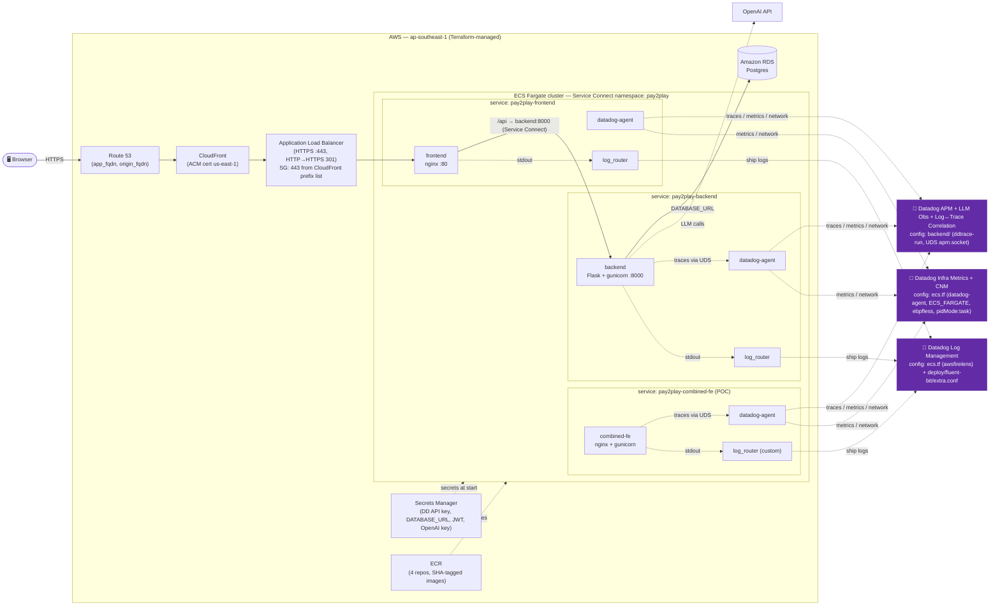

# Pay2Play — Fullstack ECS Fargate Deployment with Datadog

A multi-container financial-services demo (nginx + Flask/gunicorn + Postgres)
running on **AWS ECS Fargate** behind CloudFront + ALB, and fully instrumented
with **Datadog** APM/LLM Observability, Log Management (with log↔trace
correlation), Infrastructure metrics, and Cloud Network Monitoring. The whole
stack is provisioned with **Terraform** (remote state on S3 + DynamoDB) and
shipped by a **GitHub Actions** pipeline (OIDC → build/push to ECR →
`terraform apply`). See [`terraform/README.md`](terraform/README.md).

## Overview

Pay2Play is a deliberately small "bank" app used as a test bed for
multi-container Fargate deployments with Datadog. On Fargate it runs as **three
independent ECS services** — `pay2play-frontend`, `pay2play-backend` and the
`pay2play-combined-fe` POC — each its own task with a co-located **datadog-agent**
and **FireLens log_router** sidecar. Services discover each other through **ECS
Service Connect**, so nginx proxies `/api` to `backend:8000` by name (locally,
docker-compose provides the same DNS, which is why nginx's backend target is
templated via `BACKEND_HOST`). Persistent data lives in **Amazon RDS for
Postgres** (injected as `DATABASE_URL`). The backend uses an app-factory pattern
so future add-ons (Kafka producers/consumers, async workers) can be layered in
without restructuring.

| Component       | Tech                            | Role                                             |
| --------------- | ------------------------------- | ------------------------------------------------ |
| `frontend`      | vanilla JS + HTML + CSS, nginx  | Serves the SPA, reverse-proxies `/api`           |
| `backend`       | Python, Flask + gunicorn        | JSON API (JWT auth, accounts, transactions, LLM) |
| RDS Postgres    | Amazon RDS for PostgreSQL       | Users, accounts, transaction history             |
| `datadog-agent` | Datadog Agent sidecar (×3)      | APM / DogStatsD / infra metrics / CNM            |
| `log_router`    | AWS FireLens (Fluent Bit) (×3)  | Routes each task's logs → Datadog                |
| `combined-fe`   | nginx + gunicorn (POC)          | *Optional:* one container, logs split by source  |

## Architecture

Provisioned entirely by Terraform (`terraform/`). Edge traffic is
Route 53 → CloudFront → ALB (HTTPS only; the ALB SG admits `:443` from the
CloudFront managed prefix list). The ALB forwards `app_fqdn` to the
`pay2play-frontend` task; nginx reverse-proxies `/api` to the `pay2play-backend`
task over **Service Connect** (`backend:8000`). Each task carries its own
datadog-agent + FireLens sidecars.



## Datadog Configuration

| Signal | How it's wired | Config location |
| ------ | -------------- | --------------- |
| **APM / LLM Obs** | Backend runs under `ddtrace-run`; traces go to the Agent over a **Unix Domain Socket** (`DD_TRACE_AGENT_URL=unix:///var/run/datadog/apm.socket`). `DD_AGENT_HOST` is intentionally unset, per the ECS Fargate docs. LLM Obs is enabled via `DD_LLMOBS_ML_APP`. | `backend/entrypoint.sh`, `terraform/ecs.tf` (agent + backend env) |
| **Log↔trace correlation** | `DD_LOGS_INJECTION=true` + `python-json-logger` emit `dd.trace_id`/`dd.span_id` as top-level JSON fields. | `backend/app/logging_config.py` |
| **Logs** | FireLens (Fluent Bit) ships each container's stdout/stderr with a per-container `dd_source` (`nginx`, `python`). | `terraform/ecs.tf` (`awsfirelens` `logConfiguration`) |
| **Log source-split (POC)** | `combined-fe` emits both nginx + python logs from one container; a custom Fluent Bit config `rewrite_tag`s nginx lines to a second Datadog output so they land as `source:nginx` while JSON stays `source:python`. | `deploy/fluent-bit/extra.conf` |
| **Infra metrics** | `ECS_FARGATE=true` on the Agent yields `ecs.fargate.*` / `container.*`. | `terraform/ecs.tf` (datadog-agent) |
| **Cloud Network Monitoring** | Fargate uses the **ebpfless** tracer: `DD_SYSTEM_PROBE_NETWORK_ENABLED`, `DD_NETWORK_CONFIG_ENABLE_EBPFLESS`, `SYS_PTRACE` capability, and task-level `pidMode:task` so the Agent can observe sibling containers. | `terraform/ecs.tf` |
| **DBM** | Intentionally **off** — the stock `postgres:16` image has no `datadog` DB user (see [Notes](#notes)). | — |

## Prerequisites

- **Docker** running locally (Docker Desktop or Colima) for local runs.
- **Terraform** ≥ 1.16 and **AWS CLI v2** authenticated (for infra changes).
- A **Datadog API key** and your **site** (e.g. `datadoghq.com`).
- The AWS-side prerequisites (VPC/subnets, ALB, SGs, IAM roles, RDS, Secrets
  Manager entries, ECR repos, CloudFront, Route 53) are all defined as code in
  **[`terraform/`](terraform/)** — no manual provisioning.

> The full IaC layout, remote-state bootstrap, and pipeline are documented in
> **[`terraform/README.md`](terraform/README.md)** and
> **[`deploy/README.md`](deploy/README.md)**.

## Setup

### Local — run & validate (no Datadog)
```bash
cp .env.example .env          # optional; compose has sane defaults
docker compose up --build
```
Then browse http://localhost:8080 and log in with a seeded user, or hit the API:
```bash
curl -s localhost:8080/api/health
curl -s -X POST localhost:8080/api/auth/login \
  -H 'Content-Type: application/json' \
  -d '{"email":"ada@pay2play.test","password":"Password123!"}'
```
Seeded users: `ada@pay2play.test` / `grace@pay2play.test` — both `Password123!`.

### Local — with Datadog (APM + logs + CNM smoke test)
```bash
DD_API_KEY=xxxx docker compose -f docker-compose.yml -f docker-compose.datadog.yml up --build
```
This adds a Datadog Agent sidecar sharing the `dd-sockets` UDS volume (mirroring
the Fargate topology) and enables the eBPF-based CNM tracer locally.

### Fargate — deploy
Deployment is **Terraform + GitHub Actions**; there are no deploy scripts.

- **Normal path:** merge to `main`. The [`deploy`](.github/workflows/deploy.yml)
  workflow authenticates via OIDC, builds + pushes all four images tagged with
  the commit SHA, runs `terraform apply -var="image_tag=<sha>"`, and waits for
  the ECS services to stabilize.
- **Infra review:** open a PR touching `terraform/**`; the
  [`terraform-plan`](.github/workflows/terraform-plan.yml) workflow posts the
  plan as a PR comment.
- **Local / manual apply:**
  ```bash
  cd terraform
  eval "$(aws configure export-credentials --format env)"   # if using AWS SSO
  terraform init
  terraform apply -var="image_tag=<tag-you-pushed-to-ecr>"
  ```

See **[`terraform/README.md`](terraform/README.md)** and
**[`deploy/README.md`](deploy/README.md)** for the end-to-end walkthrough.

### API reference
| Method | Path                                | Auth   | Description                     |
| ------ | ----------------------------------- | ------ | ------------------------------- |
| GET    | `/api/health`                       | no     | Liveness + DB connectivity      |
| POST   | `/api/auth/login`                   | no     | Returns `{ accessToken, user }` |
| GET    | `/api/users/me`                     | Bearer | Current user profile            |
| GET    | `/api/accounts`                     | Bearer | Accounts for the current user   |
| GET    | `/api/accounts/{id}/transactions`   | Bearer | Transaction history             |

## Verify In Datadog Sandbox

After deploying, confirm each signal in your Datadog org:

- **APM / LLM Obs** — service `pay2play-backend` shows traces (Bearer-auth API
  calls); LLM-powered endpoints appear under the `DD_LLMOBS_ML_APP` app.
- **Logs** — Log Explorer has `source:python` and `source:nginx`; backend logs
  carry `dd.trace_id`/`dd.span_id`. If running the `combined-fe` POC, the
  **same** container yields both `source:nginx` and `source:python`.
- **Log↔trace correlation** — open a backend trace, the **Logs** tab on a span
  shows the matching records.
- **Infra metrics** — `ecs.fargate.*` and `container.*`, tagged `task_family`,
  `task_version`, `task_arn`, `short_image` (no `system.*`/`docker.*` on Fargate).
- **Cloud Network Monitoring** — the [CNM page](https://app.datadoghq.com/network)
  shows flows between `pay2play-frontend` ↔ `pay2play-backend` ↔ RDS Postgres
  (Fargate CNM is in Preview; allow a few minutes after tasks are `RUNNING`).

## Cleanup

```bash
# Local
docker compose down -v                        # also drops the DB volume

# Fargate — tear down the Terraform-managed stack
cd terraform
eval "$(aws configure export-credentials --format env)"   # if using AWS SSO
terraform destroy
```
`terraform destroy` removes only the resources Terraform manages (SGs, ALB, RDS,
ECR, CloudFront, Route 53 records, ECS cluster/services). Data sources
(VPC/subnets, IAM roles, ACM certs, Secrets Manager entries) are left untouched.
The remote-state bucket + lock table from `terraform/bootstrap/` are separate and
are not destroyed by the app stack.

## Notes

- **Database.** On Fargate, Postgres is **Amazon RDS** (managed in
  [`terraform/rds.tf`](terraform/rds.tf), injected as `DATABASE_URL`). The
  in-task `db` container only exists for **local** docker-compose, where it uses
  task-local storage and is reset on `docker compose down -v`.
- **DBM is off by default.** Enable Database Monitoring by creating a `datadog`
  DB user on RDS (see [`db/dbm/init-datadog.sql`](db/dbm/init-datadog.sql)) and
  turning on the Agent Postgres check — not yet provisioned by Terraform.
- **`combined-fe` is a POC** (non-essential container) reproducing a customer's
  "one container, two log formats, one `dd_source`" case. The fix lives in
  [`deploy/fluent-bit/extra.conf`](deploy/fluent-bit/extra.conf).
- **Fluent Bit config delivery.** The `log_router` bakes its config into a
  custom image; the AWS-recommended alternative on Fargate is the Fluent Bit
  **init image** pulling the `.conf` from S3 (`config-file-type: s3` is not
  supported on Fargate).
- **Pin image versions for anything real.** App images are pinned to the commit
  SHA by the pipeline, but the sidecars use `datadog/agent:latest` and
  `aws-for-fluent-bit:stable` for readability — pin those in production.
